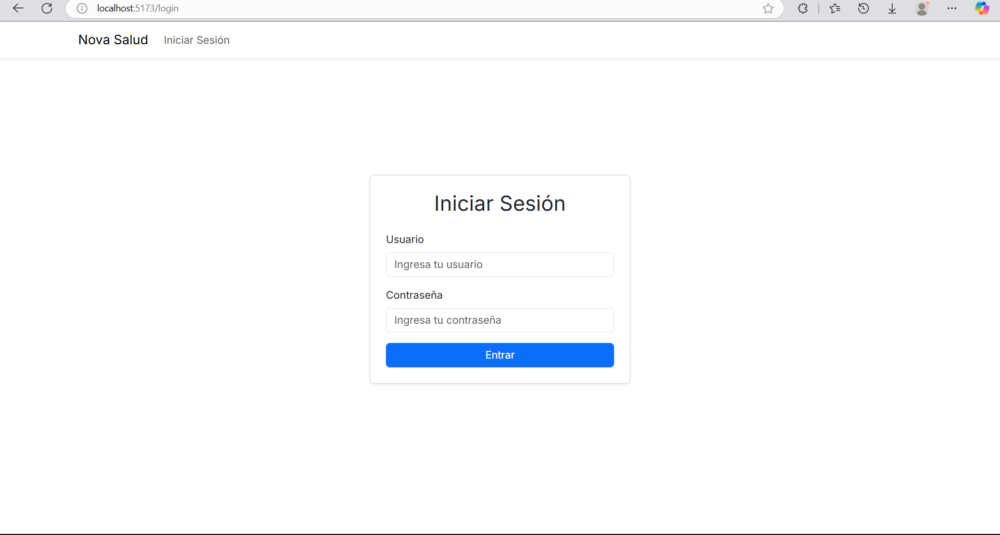
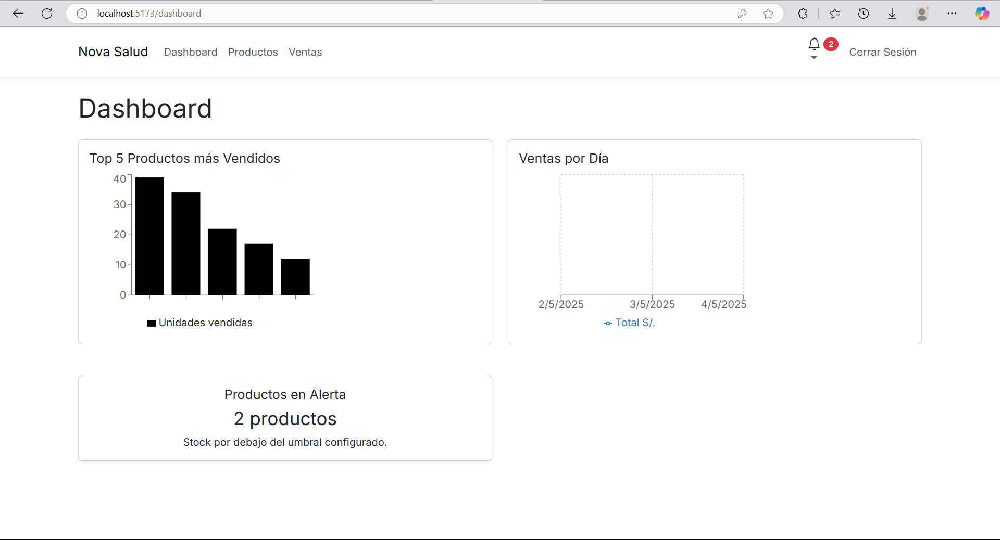
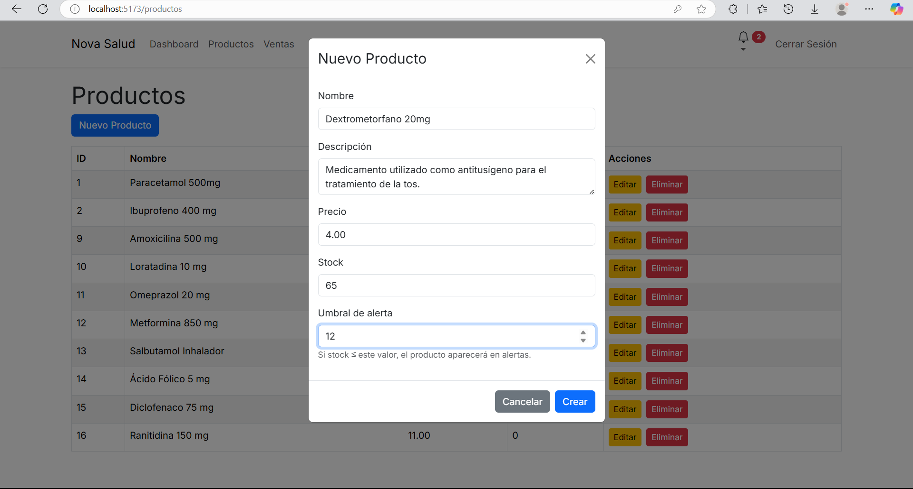
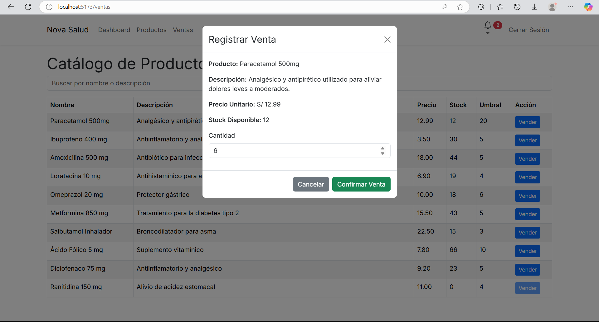

# Farmaplus Inventory

Sistema web para la gestión de inventario y ventas de una botica.

## 🎯 Objetivo del Proyecto

Facilitar la gestión de stock y ventas en boticas pequeñas, reduciendo errores manuales y mejorando la experiencia de cliente.

## 📋 Características

* **Gestión de Productos**: CRUD de productos con control de stock y umbral de alerta.
* **Ventas**: Registro de ventas con validación de stock disponible.
* **Dashboard**: Reportes de productos más vendidos, ventas por día y alertas en tiempo real.
* **Autenticación y Roles**: Acceso protegido con JWT, roles de administrador y cajero.
* **Notificaciones**: Alertas y toasts para feedback en la UI.

## 🚀 Tecnologías

* **Frontend**: React, Vite, React Router, React Bootstrap, Recharts, React-Toastify
* **Backend**: Node.js, Express, MySQL (mysql2)
* **Autenticación**: JWT, bcryptjs

## 🗂 Estructura de Carpetas

```
farmaplus-inventory/
├── backend/           # API RESTful con Node.js y Express
│   ├── config/        # Configuración de base de datos
│   ├── controllers/   # Lógica de rutas
│   ├── middleware/    # Autenticación y errores
│   ├── models/        # Modelos de datos
│   ├── routes/        # Definición de rutas
│   └── index.js       # Servidor Express
├── frontend/          # Aplicación SPA con React
│   ├── public/        # Archivos estáticos
│   ├── src/
│   │   ├── components/# Componentes reutilizables
│   │   ├── contexts/  # Context API (Auth)
│   │   ├── pages/     # Vistas principales
│   │   ├── services/  # Llamadas a la API
│   │   ├── App.jsx    # Ruteo
│   │   └── main.jsx   # Punto de entrada
│   └── vite.config.js
├── .gitignore         # Archivos ignorados por Git
└── README.md          # Documentación del proyecto
```

## 🛠 Instalación Rápida / Prerrequisitos

### Prerrequisitos

* Node.js ≥ 18
* MySQL 8.0
* Postman o Insomnia (opcional para probar la API)

### Instalación

```bash
# Clonar el repositorio
git clone https://github.com/FrankCastillo46/farmaplus-inventory.git
cd farmaplus-inventory

# Backend\  
cd backend && npm install && npm start

# Frontend\  
cd ../frontend && npm install && npm run dev
```

## 🚀 Demo / Capturas de Pantalla





## 🗄️ Endpoints de la API

| Ruta                       | Método | Descripción                      |
| -------------------------- | ------ | -------------------------------- |
| `/api/auth/login`          | POST   | Autentica usuario y devuelve JWT |
| `/api/productos`           | GET    | Lista todos los productos        |
| `/api/productos`           | POST   | Crea un producto (admin)         |
| `/api/ventas`              | POST   | Registra una venta               |
| `/api/alertas`             | GET    | Productos con stock bajo         |
| `/api/ventas/hoy`          | GET    | Total de ventas del día actual   |
| `/api/productos/sin-stock` | GET    | Cantidad de productos sin stock  |

## 📝 Guía de Uso

### Crear un Producto

```bash
POST /api/productos
Content-Type: application/json
Authorization: Bearer <TOKEN>

{
  "nombre": "Ibuprofeno 400mg",
  "descripcion": "Antiinflamatorio",
  "precio": 3.50,
  "stock": 50,
  "umbral_alerta": 10
}
```

## 🤝 Contribuciones

1. Haz un fork del repositorio
2. Crea una rama feature: `git checkout -b feature/mi-nueva-funcionalidad`
3. Haz commit de tus cambios: `git commit -m "Agrega nueva funcionalidad"`
4. Push a la rama: `git push origin feature/mi-nueva-funcionalidad`
5. Abre un Pull Request

## 📜 Historial de Versiones

* **v1.0.0** – Funcionalidad básica de productos y ventas
* **v1.1.0** – Dashboard y alertas de stock

## ⚖️ Licencia y Autor

Este proyecto está bajo la [MIT License](LICENSE).

Desarrollado por **Frank Castillo** — Estudiante de Ingeniería de Software con IA – SENATI.